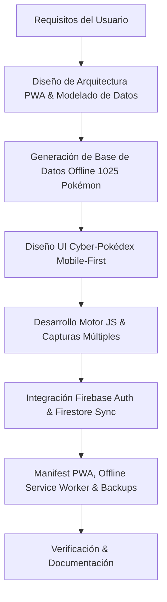

# 📑 Registro de Desarrollo y Plan de Ejecución

Este documento resume el proceso de planificación, diseño, arquitectura, desarrollo e implementación seguido para la creación de la aplicación **PokéDex Living Dex & Shiny Tracker** con **Sincronización Cloud mediante Firebase (Auth & Firestore)**.

---

## 🎯 Requisitos del Usuario

1. **Plataforma Objetivo**: Aplicación optimizada para Android (Web / PWA).
2. **Funcionalidad Pokédex**: Selección de Pokémon capturados.
3. **Registro por Juego/Versión**: Indicar en qué juego o región fue capturado el Pokémon.
4. **Capturas Múltiples**: Registrar múltiples versiones del mismo Pokémon de diferentes juegos (ej. un Pikachu capturado en *Alola* y otro Pikachu capturado en *Paldea*).
5. **Estado Shiny (Variocolor)**: Marcar si alguna de esas versiones o capturas es Shiny ✨.
6. **Detalles de Captura**: Registro opcional de Pokéball, Nivel, Naturaleza, Habilidad, Apodo y Notas.
7. **Respaldos de Datos**: Sistema para guardar y exportar/importar la información.
8. **🔥 Sincronización Multinube (Firebase)**: Integrar **Firebase Authentication** y **Cloud Firestore** para sincronizar instantáneamente todos los registros entre múltiples dispositivos (celulares, tablets y PCs).

---

## 📋 Plan de Desarrollo Ejecutado



### 1. Arquitectura y Modelado de Datos
- **Enfoque PWA**: Tecnología HTML5 + CSS3 + Vanilla JS (ES Modules) para garantizar ejecución instantánea, cero dependencia de compilaciones pesadas de APK y compatibilidad total en Android e iOS.
- **Modelo de Datos de Captura**:
  ```json
  {
    "id": "cap_1727567890_abc",
    "pokemonId": 25,
    "pokemonName": "Pikachu",
    "game": "Sun & Moon (Alola)",
    "isShiny": true,
    "ball": "Fast Ball",
    "level": 75,
    "nature": "Timid",
    "ability": "Lightning Rod",
    "nickname": "Sparky ✨",
    "notes": "Capturado en Paldea / Evento Shiny Tera Incursión",
    "date": "2026-09-28"
  }
  ```

### 2. Base de Datos Offline (`pokemon_data.js`)
- **Pokédex Nacional**: Integración de los 1025 Pokémon (Generaciones 1 a 9).
- **Catálogo de Juegos**: 37 juegos oficiales organizados por generación (Red/Blue hasta Scarlet/Violet) más entregas espinoffs (Pokémon GO, Pokémon HOME, Leyendas Z-A).
- **Pokéballs & Naturalezas**: Catálogo de 32 tipos de Pokéball y 25 naturalezas oficiales.

### 3. Interfaz de Usuario y Estilos (`styles.css`)
- **Diseño Móvil Estilo Cyber-Pokédex**: Fondo oscuro (`#090d16`), tarjetas translúcidas con `backdrop-filter`, colores por tipo Pokémon y efectos neón dorados para los registros Shiny ✨.
- **Componentes**:
  - Encabezado con barra de progreso rápido, contador e **Indicador de Sincronización Firebase (🟢 Sincronizado / 🟡 Sincronizando / 🔴 Modo Local)**.
  - Barra de búsqueda y chips de filtro horizontal scrollable.
  - Tarjetas de Pokédex con insignias de juego y contador de ejemplares.
  - Modal deslizante desde abajo (Drawer) para capturas, detalle de Pokémon y menú de **Autenticación Firebase**.
  - Barra de navegación inferior (Bottom Navigation Bar) fija.

### 4. Sincronización Multinube con Firebase (`firebase-config.js` y `app.js`)
- **Firebase Authentication**:
  - **Google Sign-In**: Inicio de sesión mediante ventana emergente.
  - **Correo / Contraseña**: Formularios de inicio de sesión y registro rápido.
  - **Acceso Invitado (Anónimo)**: Permite probar la sincronización sin crear cuentas personales.
  - **Gestor de Configuración Personalizada**: Permite a los usuarios ingresar sus propias llaves de proyecto de Firebase desde la propia interfaz de Ajustes.
- **Cloud Firestore Real-Time Synchronization**:
  - Estructura Firestore: `users/{userId}/captures/{captureId}`.
  - **Sincronización en tiempo real con `onSnapshot`**: Cualquier captura añadida o eliminada en el Celular A se refleja instantáneamente en el Celular B o Computadora.
  - **Fusión Offline/Online**: Al iniciar sesión por primera vez, los registros locales guardados en `localStorage` se migran automáticamente a Firestore sin perder datos.
  - **Persistencia fuera de línea habilitada**: Mantiene la velocidad de respuesta local y sincroniza automáticamente al recuperar la conexión a internet.

### 5. Soporte PWA y Modo Offline (`manifest.json` y `sw.js`)
- Manifiesto PWA para permitir la opción "Agregar a la pantalla de inicio" en Android con modo `standalone` (pantalla completa sin interfaz del navegador).
- Service Worker para caché fuera de línea del app shell y recursos.
